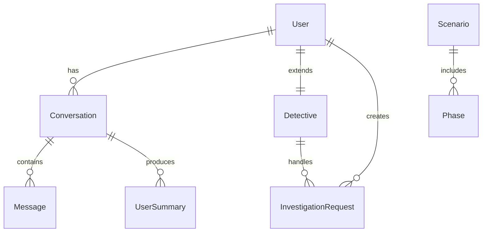

# 1. 개요 (Overview)

## 1.1 문서 목적 및 작성 배경
LIRA (Legal Investigation & Research Assistant)는 AI를 활용하여 일반 사용자가 자신의 사건(불륜 의심, 실종, 신용/배경, 보험사기, 기업 내부 이슈 등)에 대해 1차 상담을 받고, 적합한 민간조사원(탐정)을 탐색·매칭받을 수 있도록 돕는 플랫폼입니다. 본 문서는 인프라 설계, 데이터베이스 구축, 개발 표준 수립을 위해 시스템/서비스 요구사항과 기능, 데이터 구조, 인터페이스, 비기능 요구사항을 명확히 정의하는 것을 목적으로 합니다.

## 1.2 시스템/서비스 전체 개요
플랫폼은 다음 5개 핵심 영역으로 구성됩니다:
1. 사용자 계정 및 인증(회원가입, 로그인, 토큰/세션 관리)
2. AI 기반 사건 상담 및 분석(엘AI 챗 인터페이스)
3. 사건 사례(시나리오) 라이브러리 및 지식 탐색
4. 탐정(민간조사원) 프로필 및 매칭 추천
5. 조사 진행 현황 및 결과(보고/통계) 제공

## 1.3 개발 범위
포함되는 범위(Phase 1):
- 웹 기반 사용자/탐정/관리자 3역할 지원 (반응형 UI)
- 이메일+비밀번호 기반 인증 및 기본 권한 관리
- AI 상담(텍스트 기반) 및 사건 분류, 키워드 추출, 시나리오 추천
- 사건 사례(라이브러리) 조회 및 필터링
- 기본적인 탐정 프로필 CRUD 및 추천 로직(간단한 규칙/키워드 매칭)
- 조사 요청(Investigation Request) 생성 및 상태 추적
- 사용자 요약 및 대화 이력 저장
- 관리자: 사용자/탐정 승인, 사례 관리
- 초기 로깅 & 에러 모니터링(애플리케이션 로그 수준)

## 1.4 제외 범위(Phase 1 기준)
- 결제/정산 모듈 (Phase 2 예정)
- 실시간 WebSocket 기반 다자간 채팅(현재는 단일 AI 세션)
- 영상/음성 스트리밍 상담
- 모바일 네이티브 앱(iOS/Android)
- 고도화된 추천(ML 기반 모델 학습) – 규칙/키워드 기반만 구현
- 다국어 지원(한국어 우선)
- 외부 신원 조회, 정부 DB 연동(법적 검토 후 후속 도입)

## 1.5 이해관계자(Stakeholders)
- 최종 사용자(의뢰인)
- 탐정/민간조사원
- 플랫폼 관리자(운영자)
- 법률 자문/컴플라이언스 담당(간접)
- 인프라/DevOps 엔지니어

## 1.6 성공 지표(KPI) 예시
- AI 초기 상담 완료율
- 상담 후 조사 요청 전환율
- 매칭된 조사원의 응답 속도
- 사건 유형별 해결(완료) 비율
- 사용자 재방문율 / NPS

---
(이후 섹션은 아래에 계속 작성될 예정)

# 2. 요구사항 정리 (Requirements Summary)

## 2.1 비즈니스 요구사항
| 코드 | 요구사항 | 배경/목표 | 우선순위 |
|------|----------|-----------|----------|
| BR-01 | 초기 AI 1차 상담 자동화 | 탐정 인입 전 기본 정보 수집 비용 절감 | High |
| BR-02 | 사건 유형 분류 및 비용/기간 사전 안내 | 사용자 불안감 해소 및 전환율 증가 | High |
| BR-03 | 적합한 탐정 추천 | 매칭 정확도 향상 및 만족도 개선 | High |
| BR-04 | 사건 사례(라이브러리) 제공 | 정보 비대칭 해소 및 신뢰 확보 | Medium |
| BR-05 | 진행 상태 추적 | 투명성 제공, 분쟁 감소 | Medium |
| BR-06 | 관리자 승인 및 품질 관리 | 서비스 품질 유지 | High |
| BR-07 | 로그/모니터링 기반 운영 분석 | 안정적 운영 | Medium |

## 2.2 사용자 요구사항 (Roles)
| 역할 | 요구사항 | 상세 |
|------|----------|------|
| 의뢰인 | 빠르고 쉬운 사건 설명 | 자유 서술 + 가이드 질문 제공 |
| 의뢰인 | 예상 비용/기간 알고 싶음 | AI 분석 후 범위 제시 |
| 의뢰인 | 신뢰할 수 있는 탐정 확인 | 검증 배지, 평점, 경력 |
| 의뢰인 | 유사 사건 결과 보고 확인 | 사례 리스트 + 해결 방식 |
| 탐정 | 본인 전문분야 노출 | 태그/전문영역 등록 |
| 탐정 | 의뢰 요청 수신 및 수락 | 요청 상태 변경 |
| 관리자 | 탐정 승인/비활성화 | 검증 프로세스 |
| 관리자 | 사례 CRUD | 콘텐츠 유지관리 |

## 2.3 시스템 요구사항
| 구분 | 항목 | 요구사항 |
|------|------|----------|
| 플랫폼 | 지원환경 | 최신 Chrome/Edge/Safari, 모바일 대응(Responsive) |
| 백엔드 | API | RESTful, JSON 기반 |
| 인증 | 보안 | JWT + HTTPS, 비밀번호 해싱(BCrypt) |
| 데이터 | 저장 | PostgreSQL + Prisma ORM |
| AI | 연동 | OpenAI Chat Completion 사용 |
| 성능 | 응답 | 주요 API P95 1s 이하, AI 응답 10s 이내 |
| 로그 | 수집 | 요청/에러/비정상 탐지 |
| 확장성 | 구조 | 모듈형 서비스, 향후 마이크로서비스 전환 용이 |
| 배포 | 전략 | Git 기반 CI/CD, Blue-Green 또는 Rolling |

## 2.4 제약조건
- 법적 규제: 민간조사 관련 국내 법률 준수 필요(민감정보 수집 제한)
- AI 모델 비용: Token 사용량 최적화 필요
- 개인정보: 최소 수집 원칙 및 암호화 저장

---

# 3. 기능 정의 (Functional Definition)

아래 표는 주요 기능별 요약이다. 상세 Use Case는 뒤 subsections에 기술.

## 3.1 기능 목록 요약
| 코드 | 기능명 | 개요 | 주요 입력 | 처리 로직 | 출력 |
|------|--------|------|-----------|-----------|------|
| F-01 | 회원가입 | 신규 사용자 계정 생성 | 이메일, 비밀번호, 이름 | 중복확인→비밀번호 해시→저장 | JWT(로그인 시), 사용자 레코드 |
| F-02 | 로그인 | 세션 발급 | 이메일, 비밀번호 | 검증→JWT 생성 | 토큰, 사용자 정보 |
| F-03 | AI 상담 세션 시작 | 대화 컨텍스트 초기화 | 사용자 질문 | 프롬프트 구성→OpenAI 호출 | 첫 응답 메시지 |
| F-04 | AI 메시지 교환 | 다회 메시지 처리 | 대화ID, 메시지 | 히스토리 로드→AI 응답 | AI 답변, 토큰소모 |
| F-05 | 사건 유형 분류 | 텍스트 분석 | 상담 내역 | 키워드 추출→룰 매칭 | 사건 유형 라벨 |
| F-06 | 시나리오 추천 | 사례 후보 제공 | 사건 유형/키워드 | 유사도 규칙 | 시나리오 리스트 |
| F-07 | 탐정 추천 | 적합 탐정 목록 | 사건 유형, 예산 | 전문태그/성공률 정렬 | 추천 탐정 배열 |
| F-08 | 조사 요청 생성 | 의뢰 생성 | 사건 요약, 예산 | 상태=Pending 저장 | 요청 ID |
| F-09 | 요청 상태 변경 | 진행 관리 | 요청ID, 상태 | 권한검사→업데이트 | 변경 결과 |
| F-10 | 사례 라이브러리 조회 | 사례 검색 | 필터(유형) | 조건 검색 | 사례 목록 |
| F-11 | 관리자 탐정 승인 | 자격 검증 | 탐정ID | 승인플래그 ON | 갱신된 탐정 |
| F-12 | 사용자 요약 저장 | 대화 기반 요약 | 사용자ID, 요약 | 기존 존재 시 업데이트 | 저장 성공 |

## 3.2 대표 기능 상세 Use Case

### F-03 AI 상담 세션 시작
- 사전조건: 사용자 로그인(선택적, 비로그인 모드 제한된 기능 가능)
- 기본 흐름:
  1. 사용자: 첫 질문 입력(“남편이 최근…”)
  2. 시스템: 새로운 conversation 생성(ID 발급)
  3. 시스템: 초기 시스템 프롬프트 + 사용자 메시지 구성
  4. OpenAI 호출 → 응답 저장
  5. 사용자에게 AI 첫 답변 표시
- 예외:
  - E1 OpenAI 실패 → 재시도(최대2회) 후 오류 메시지
  - E2 금지어/민감정보 과다 포함 → 마스킹 후 진행

### F-07 탐정 추천
- 사전조건: 사건 유형 분류 완료 또는 사용자가 직접 선택
- 흐름:
  1. 시스템: 사건 유형, 키워드 확보
  2. DB: 해당 전문태그 가진 탐정 검색
  3. 정렬: (검증여부→성공률→경력→평점)
  4. 상위 N(기본 3~5명) 반환
- 예외:
  - E1 후보 0명 → “추가 정보 요청” 메시지
  - E2 필수 데이터 누락 → 로그 후 기본 안전 응답

(추가 기능 상세는 후속 작성 예정)

## 3.3 기능별 예외 및 제약 요약
| 기능코드 | 주요 예외상황 | 처리 방식 | 로그 레벨 |
|----------|---------------|-----------|-----------|
| F-01 | 이메일 중복 | 409 Conflict 반환 | WARN |
| F-02 | 비밀번호 불일치 | 401 Unauthorized | INFO |
| F-03 | OpenAI Timeout | 재시도 후 실패 | ERROR |
| F-04 | 토큰 한도 초과 | 추가 구매/제한 안내 | WARN |
| F-05 | 분류 불가(불명확) | 추가 질문 유도 | INFO |
| F-06 | 사례 0건 | 기본 대표 사례 노출 | INFO |
| F-07 | 탐정 0명 | 재검색/정보 보강 요청 | WARN |
| F-08 | 필수 필드 누락 | 400 Bad Request | WARN |
| F-09 | 권한 없음 | 403 Forbidden | WARN |
| F-10 | DB 연결 문제 | 재시도/Failover | ERROR |

---

# 4. 화면 / 인터페이스 정의 (UI/UX Specification)

## 4.1 주요 화면 목록
| 코드 | 화면명 | 경로 | 목적 |
|------|--------|------|------|
| V-01 | 랜딩 페이지 | `/` | 서비스 소개 및 CTA |
| V-02 | 로그인 | `/login` | 인증 |
| V-03 | 회원가입 | `/register` | 신규 가입 |
| V-04 | AI 상담(챗) | `/simulation` | 사건 초기 상담 |
| V-05 | 사례 라이브러리 목록 | `/scenarios` | 사건 정보 탐색 |
| V-06 | 사례 상세 | `/scenarios/[id]` | 상세 단계/비용 확인 |
| V-07 | 탐정 프로필 목록 | `/persona` | 탐정 탐색 |
| V-08 | 조사 요청/상태 | `/report` | 진행 상황/통계 |
| V-09 | 관리자 대시보드 | `/admin` | 운영/승인 |
| V-10 | 탐정 목록 | `/detectives` | 탐정 목록 탐색 |
| V-11 | 탐정 등록 | `/detectives/new` | 탐정 등록(역할 전환 신청) |

## 4.2 공통 UI 요소
| 요소 | 설명 | 상태/Variation |
|------|------|----------------|
| Primary Button | 핵심 행동(CTA) | Enabled / Hover / Loading / Disabled |
| Input Field | 텍스트 입력 | Normal / Focus / Error / Disabled |
| Alert Banner | 시스템 메시지 | Info / Success / Warning / Error |
| Modal | 확인/추가 입력 | Small / Large |
| Tag | 사건 유형 / 전문분야 | 색상: 유형별 매핑 |

## 4.3 화면 전환 흐름(요약)
1. 비로그인 사용자는 `/` → (CTA) → `/login` 또는 `/register`
2. 로그인 후 첫 진입: `/simulation` (AI 상담 유도)
3. 상담 도중 추천 링크 통해 `/scenarios` 또는 `/persona`
4. 조사 요청 생성 시 `/report`에서 상태 추적
5. 관리자 계정은 `/admin` 접근 가능(역할 기반 가드)
6. 탐정은 `/detectives`에서 목록 조회 및 `/detectives/new`에서 등록

## 4.4 접근성 & UX 고려
- 키보드 포커스 순서 보장
- 폰트 대비 WCAG AA 이상 권장
- 주요 버튼 aria-label 제공

---

# 5. 데이터 정의 (Data Specification)

## 5.1 엔티티 개요
| 엔티티 | 주요 필드 | 설명 |
|--------|----------|------|
| User | id, email, role, remainingTokens | 사용자 계정 |
| Conversation | id, userId, status | 상담 세션 |
| Message | id, conversationId, role, content | 대화 메시지 |
| Scenario | id, title, industry, difficulty | 사건 사례 메타 |
| Phase | id, scenarioId, name, durationDays | 단계별 정보 |
| Detective | id, userId, specialties, successRate | 탐정 프로필 |
| InvestigationRequest | id, userId, detectiveId, status | 의뢰/매칭 요청 |
| UserSummary | id, userId, summary, keywords | 요약 데이터 |

## 5.2 핵심 API Request/Response 예시
### 회원가입
Request: POST `/api/register`
```
{ "email":"a@b.com", "password":"*******", "name":"홍길동" }
```
Response 201:
```
{ "id": 12, "email":"a@b.com", "role":"user" }
```

### AI 메시지 교환
Request: POST `/api/chat-gpt`
```
{ "conversationId":"c123", "message":"남편이 늦게 들어옵니다" }
```
Response 200:
```
{ "reply":"상황 이해했습니다. 최근 변화된 패턴이 있었나요?", "tokens": 128 }
```

## 5.3 필수/옵션 & 검증 규칙 예(발췌)
| 필드 | 규칙 | 오류 코드 |
|------|------|-----------|
| email | RFC 형식, 중복 불가 | ERR_EMAIL_INVALID / ERR_EMAIL_DUP |
| password | 최소8자, 대소문자/숫자 1개 이상 | ERR_PW_POLICY |
| budget | 0 이상 정수 | ERR_BUDGET_RANGE |
| caseType | 사전 정의 Enum | ERR_CASETYPE_INVALID |

## 5.4 데이터 일관성 규칙
- Conversation 삭제 시 Message 연쇄 삭제(CASCADE)
- User 삭제는 소프트 삭제 플래그(직접 물리 삭제 금지)
- 탐정 비활성화 시 추천 제외

---

# 5A. 심화 DB 설계 (Advanced Database Design)

## 5A.1 ERD 논리 구조 서술
User (1) - (N) Conversation
Conversation (1) - (N) Message
User (1) - (1) Detective (역할이 'detective' 인 경우 선택적 매핑)
Scenario (1) - (N) Phase
User (1) - (N) InvestigationRequest (의뢰인)
Detective (1) - (N) InvestigationRequest (담당자)
Conversation (1) - (N) UserSummary (요약 이력)

## 5A.2 상태(State Machine) 정의
### InvestigationRequest.status
| 상태 | 설명 | 전이(Transitions) |
|------|------|------------------|
| pending | 탐정 수락 전 | → accepted, → cancelled |
| accepted | 탐정이 수락 | → in_progress, → cancelled |
| in_progress | 조사 진행 중 | → completed, → cancelled |
| completed | 종료/보고 완료 | (종료) |
| cancelled | 취소됨 | (종료) |

### Detective.isVerified / isActive
- isVerified = true 여야 추천 풀 포함
- isActive = false 이면 검색/추천 제외

## 5A.3 인덱스 전략 (PostgreSQL)
| 테이블 | 필드 | 인덱스 유형 | 목적 |
|--------|------|-------------|------|
| users | email | UNIQUE BTREE | 로그인 조회 |
| conversations | userId, createdAt | BTREE 복합 | 사용자 히스토리 역순 조회 |
| messages | conversationId, createdAt | BTREE | 대화 스크롤/페이지네이션 |
| scenarios | industry, difficulty | BTREE | 필터 검색 |
| detectives | specialties (GIN) | GIN (JSONB/배열) | 전문분야 태그 검색 |
| investigation_requests | userId,status,updatedAt | BTREE 복합 | 진행 현황 필터 |

## 5A.4 파티션/보존 정책
- messages: 12개월 초과 데이터 별도 아카이브 테이블 이동 (파티셔닝 후보)
- user_summaries: 최신 3개만 활성, 이외 이력 테이블 분리 가능

## 5A.5 Prisma 모델 예시 (발췌)
```
model User {
  id            Int       @id @default(autoincrement())
  email         String    @unique
  password      String
  name          String
  role          UserRole  @default(user)
  remainingTokens Int     @default(1000)
  conversations Conversation[]
  detective     Detective?
  requests      InvestigationRequest[] @relation("ClientRequests")
  summaries     UserSummary[]
  createdAt     DateTime  @default(now())
  updatedAt     DateTime  @updatedAt
}

enum UserRole { user detective admin }

model Detective {
  id          Int      @id @default(autoincrement())
  user        User     @relation(fields: [userId], references: [id])
  userId      Int      @unique
  name        String
  specialties String[]
  experience  Int?
  rating      Float?
  successRate Float?
  description String?
  isVerified  Boolean  @default(false)
  isActive    Boolean  @default(true)
  requests    InvestigationRequest[] @relation("DetectiveAssignments")
  createdAt   DateTime @default(now())
  updatedAt   DateTime @updatedAt
}
```

## 5A.6 무결성 & 트랜잭션 패턴
- 의뢰 생성 + 초기 상태 로그 기록: 단일 트랜잭션 처리
- 탐정 승인 시: Detective.isVerified=true + 감사 로그 삽입

## 5A.7 감사 로그(Audit Log) (확장)
| 필드 | 설명 |
|------|------|
| id | PK |
| actorUserId | 수행자 |
| entityType | User/Detective/Request 등 |
| entityId | 엔티티 ID |
| action | CREATED/UPDATED/STATUS_CHANGE |
| before | JSON 스냅샷 |
| after | JSON 스냅샷 |
| createdAt | 타임스탬프 |

---

# 5B. RBAC 권한 모델

## 5B.1 역할 정의
| 역할 | 설명 |
|------|------|
| user | 일반 의뢰 사용자 |
| detective | 조사 수행자(탐정) |
| admin | 시스템 운영자 |

## 5B.2 리소스 권한 매트릭스
| 리소스 | 액션 | user | detective | admin |
|--------|------|------|-----------|-------|
| User 프로필 | Read Self | ✓ | ✓ | ✓ |
| User 프로필 | Update Self | ✓ | ✓ | ✓ |
| Detective 프로필 | Create | ✗ | ✓(최초 등록) | ✓ |
| Detective 프로필 | Read | 제한(공개필드) | ✓ | ✓ |
| Detective 프로필 | Update | ✗ | ✓(본인) | ✓ |
| Scenario | List | ✓ | ✓ | ✓ |
| Scenario | Create/Update/Delete | ✗ | ✗ | ✓ |
| Conversation | Create | ✓ | ✓ | ✓ |
| Conversation | Read | 본인 제한 | 본인 제한 | 전체(운영목적) |
| Message | Create | ✓ | ✓ | ✓ |
| InvestigationRequest | Create | ✓ | ✗ | ✓ |
| InvestigationRequest | Accept | ✗ | ✓(할당시) | ✓ |
| InvestigationRequest | Status Update | 본인 소유 일부 | 담당 탐정 | ✓ |
| UserSummary | Read | 본인 | 본인 관련 | ✓ |

## 5B.3 미들웨어 권한 체크 흐름
1. JWT 파싱 → userId, role 추출
2. 요청 경로/메서드 매핑 → 권한 매트릭스 조회
3. 리소스 소유권 검사(필요 시 DB 조회)
4. 실패 시 403, 성공 시 다음 핸들러

## 5B.4 예시 Pseudo Code
```
function authorize(required) {
  return async (req,res,next)=>{
    const user = req.context.user; // decoded JWT
    if(!user) return res.status(401).json({code:'ERR_UNAUTH'});
    if(!required.roles.includes(user.role)) return res.status(403).json({code:'ERR_FORBIDDEN'});
    if(required.ownership){
       const entity = await loadEntity(req.params.id);
       if(entity.userId !== user.id) return res.status(403).json({code:'ERR_OWNERSHIP'});
    }
    next();
  }
}
```

---

# 5C. 탐정 등록/목록 페이지 명세

## 5C.1 페이지 개요
| 코드 | 경로 | 목적 |
|------|------|------|
| V-10 | `/detectives` | 탐정 목록 탐색 |
| V-11 | `/detectives/new` | 탐정 등록(역할 전환 신청) |

## 5C.2 기능 상세
### 탐정 목록(`/detectives`)
- 필터: 전문분야 태그, 평점 최소, 검증 여부
- 정렬: 검증여부>평점>경력
- 페이징: 기본 20개, cursor 기반
- 카드 정보: 이름, 전문태그, 경력(년), 성공률, 평점, 검증 배지

### 탐정 등록(`/detectives/new`)
- 입력: 이름(기본 user.name), 전문분야 태그(다중), 경력(숫자), 자기소개
- 제출 시: Detective 레코드 생성(Pending 승인 시 isVerified=false)
- 승인 프로세스: admin이 검토 후 isVerified true 설정

## 5C.3 UI 요소 (발췌)
| 요소 | 설명 |
|------|------|
| Tag Selector | 다중 선택 자동완성 |
| Rating Badge | 0~5 시각화 |
| Verified Icon | Shield / Check 아이콘 |

## 5C.4 API 연계
| 기능 | 메서드 | 경로 | 권한 | 비고 |
|------|--------|------|------|------|
| 목록 조회 | GET | /api/detectives | all | 공개필드만 |
| 단건 조회 | GET | /api/detectives/:id | all | 404 처리 |
| 등록 | POST | /api/detectives | user/detective | user→detective 전환 |
| 수정 | PATCH | /api/detectives/:id | 본인/관리자 | 전문분야 변경 등 |
| 승인 | POST | /api/detectives/:id/verify | admin | isVerified true |

## 5C.5 Validation 규칙
| 필드 | 규칙 |
|------|------|
| specialties | 최소 1개, 최대 10개 |
| experience | 0~60 범위 |
| description | 10~1000자 |

---

# 5D. API 상세 스펙 (추가)

## 5D.1 표준 응답 포맷
```
{ "success": true, "data": {...}, "meta": {...} }
{ "success": false, "error": { "code":"ERR_CODE", "message":"설명" } }
```

## 5D.2 에러 코드 표준
| 코드 | HTTP | 의미 |
|------|------|------|
| ERR_UNAUTH | 401 | 인증 필요 |
| ERR_FORBIDDEN | 403 | 권한 부족 |
| ERR_NOT_FOUND | 404 | 리소스 없음 |
| ERR_VALIDATION | 400 | 입력 검증 실패 |
| ERR_RATE_LIMIT | 429 | 호출 과다 |
| ERR_CONFLICT | 409 | 중복/상태충돌 |
| ERR_AI_TIMEOUT | 504 | AI 응답 지연 |
| ERR_INTERNAL | 500 | 서버 내부 오류 |

## 5D.3 예시: 탐정 등록
Request:
```
POST /api/detectives
{
  "specialties":["배우자불륜","보험사기"],
  "experience":5,
  "description":"10년차 수사 경험 기반 정확한 사실 확인을 제공합니다."
}
```
Response 201:
```
{
  "success": true,
  "data": {
    "id": 33,
    "name": "홍길동",
    "specialties": ["배우자불륜","보험사기"],
    "isVerified": false
  }
}
```

---

# 7A. 인프라 상세 설계 (Infrastructure)

## 7A.1 레이어 구성
| 레이어 | 컴포넌트 |
|--------|----------|
| Edge | CDN (정적 리소스), WAF |
| App | Next.js 서버 (SSR/API) 다중 인스턴스 |
| Data | PostgreSQL Primary + Read Replica(선택) |
| AI | OpenAI External API |
| Observability | Log 수집(Cloud Logging), Metrics(Prometheus 호환), Tracing(OTel) |

## 7A.2 네트워크
- VPC 내부 서브넷: App / DB 분리
- Security Group / NSG: App→DB 5432 제한, 외부 직접 DB 접근 차단

## 7A.3 배포 파이프라인(CI/CD)
| 단계 | 작업 |
|------|------|
| Build | 의존성 설치, lint, test, prisma generate |
| Security Scan | SAST/Dependency Scan |
| Migrate | prisma migrate deploy |
| Deploy | 무중단 (Blue-Green / Vercel Preview) |
| Post Deploy | Smoke Test, 롤백 트리거 조건 검사 |

## 7A.4 환경변수(.env)
| 변수 | 설명 |
|------|------|
| DATABASE_URL | PostgreSQL 연결 문자열 |
| OPENAI_API_KEY | OpenAI Key |
| JWT_SECRET | 서명 키 |
| LOG_LEVEL | info/warn/error |
| RATE_LIMIT | 분당 최대 호출 |

## 7A.5 로깅 & 모니터링
- 애플리케이션 로그: JSON 구조 (timestamp, level, message, traceId)
- 추적: 요청 단위 traceId 생성 → AI 호출에도 전달
- 메트릭 예: http_request_duration_seconds, ai_tokens_used_total

## 7A.6 캐싱 전략(초기)
- 시나리오/사례 목록 5분 메모리 캐시
- OpenAI 응답 요약 캐시(동일 프롬프트 1분)

## 7A.7 백업/복구
- DB: 일일 전체 백업 + 7일 PITR
- 로그: 30일 보관

---

# 8A. 보안 상세
| 영역 | 대책 |
|------|------|
| 인증 | JWT HS256 (만료 1h), Refresh Token(옵션) |
| 접근제어 | RBAC + 소유권 검사 |
| 데이터보호 | 비밀번호 BCrypt, 민감 키워드 마스킹 |
| 전송보안 | TLS 1.2 이상 |
| 입력검증 | 서버측 Validation Schema(Zod 등) |
| Rate Limit | IP + 사용자 기반 동시 적용 |
| 비정상 탐지 | 5분 내 실패 로그인 5회 → 잠금 15분 |
| 감사 | 관리자/권한 변경 Audit Log |

## 8A.1 비밀관리
- Production: Secret Manager / KMS
- 로컬: .env (git ignore)

## 8A.2 취약점 관리
- 주기적 디펜던시 스캔 (주 1회)
- OWASP Top 10 점검 체크리스트 운영

---

# 9. 변경 이력 업데이트
| 버전 | 날짜 | 작성자 | 변경 내용 |
|------|------|--------|-----------|
| 0.1 | 2025-09-15 | System | 초기 작성 |
| 0.2 | 2025-09-15 | System | DB/RBAC/인프라 상세 확장 |
| 0.3 | 2025-09-15 | System | 확장(OpenAPI/성능/보안/운영 등) |
| 0.4 | 2025-09-15 | System | 추가 확장 제안(Roadmap) |

# 10. OpenAPI 사양 초안 (발췌)
```
openapi: 3.0.3
info:
  title: LIRA API
  version: 0.1.0
servers:
  - url: https://api.lira.example
paths:
  /api/register:
    post:
      summary: 사용자 회원가입
      requestBody:
        required: true
        content:
          application/json:
            schema:
              type: object
              required: [email,password,name]
              properties:
                email: { type: string, format: email }
                password: { type: string, minLength: 8 }
                name: { type: string }
      responses:
        '201': { description: Created }
        '409': { description: Duplicate email }
  /api/detectives:
    get:
      summary: 탐정 목록
      parameters:
        - in: query
          name: specialties
          schema: { type: string }
        - in: query
          name: verified
          schema: { type: boolean }
      responses:
        '200': { description: OK }
```

# 11. Rate Limiting & 에러 확장
| 구분 | 한도 | 윈도우 | 전략 |
|------|------|--------|------|
| 인증 시도 | 10회 | 10분 | 계정 잠금 15분 |
| 일반 API | 1000 req | 10분 | 429 + Retry-After |
| AI 호출 | 60 req | 10분 | 큐잉 또는 거절 |
| 관리자 API | 300 req | 10분 | 추가 모니터링 |

표준 에러 필드 확장:
```
error: {
  code: 'ERR_CODE',
  message: '사람이 읽을 수 있는 설명',
  detail: {...추가진단정보},
  traceId: 'abc123'
}
```

# 12. 시퀀스 다이어그램 (텍스트 표현)
## 12.1 회원가입 흐름
User -> WebApp: POST /api/register
WebApp -> DB: INSERT User
DB --> WebApp: OK
WebApp --> User: 201 Created

## 12.2 AI 상담 메시지 흐름
User -> WebApp: POST /api/chat-gpt
WebApp -> DB: Load Conversation
WebApp -> OpenAI: ChatCompletion(Request)
OpenAI --> WebApp: Response
WebApp -> DB: Insert Message(User+AI)
WebApp --> User: AI Reply

## 12.3 탐정 추천 흐름
WebApp -> DB: Load case summary
WebApp -> DB: Query detectives by specialties
WebApp: Sort by verified > successRate > experience
WebApp --> User: Top N

# 13. 추천 알고리즘 상세
Pseudo:
```
function recommendDetectives(caseType, keywords, limit=5){
  const base = queryDetectives({active:true, verified:true});
  scoreEach(det){
    let score = 0;
    if(det.specialties contains caseType) score += 50;
    score += intersect(det.specialties, keywords).length * 5;
    score += (det.successRate||0) * 20;  // successRate 0~1
    score += (det.rating||0) * 4;        // rating 0~5
    score += Math.min(det.experience||0,20) * 1; // cap 20
    return score;
  }
  return base.map(d=>({...d,score:scoreEach(d)}))
             .sort((a,b)=>b.score-a.score)
             .slice(0,limit);
}
```
추가 개선 아이디어:
- 탐정 가용성(최근 배정 수) 패널티
- 지역 일치 가중치
- 직전 실패 사례 연관 탐정 제외

# 14. 캐싱 & 성능 전략
| 대상 | 전략 | TTL | 무효화 |
|------|------|-----|--------|
| 시나리오 목록 | 메모리 LRU | 300s | CRUD 발생 시 삭제 |
| 탐정 목록 필터결과 | Key 기반 캐시 | 120s | 탐정 변경 시 삭제 |
| OpenAI 요약 | SHA(prompt) 키 | 60s | 항상 만료 대기 |
| 정적 자산 | CDN Cache | 7d | 해시 파일명 |

성능 버짓(초기 목표):
- FCP < 2.0s (데스크톱), TTFB < 0.35s(App 서버)
- DB 평균 쿼리 < 50ms, 95th < 120ms

용량 계획(가정 기반 1년):
- 일평균 대화 메시지 50k → 12개월 18M (아카이브 필요)
- 탐정 프로필 5k, 시나리오 5k (소규모)

# 15. 운영 Runbook (요약)
| 이벤트 | 탐지 | 1차 대응 | 에스컬레이션 |
|--------|------|----------|--------------|
| DB 연결 폭주 | 연결 수 임계 초과 | Read Replica 증설/재시작 | DBA |
| OpenAI 지연 | P95 > 15s | 모델 다운그레이드/캐시 강화 | Tech Lead |
| 에러율 급증 | 5분 5% 초과 | 최근 배포 롤백 | Dev 팀 |
| 인증 실패 다수 | 로그인 실패율 > 20% | Rate Limit 검증 | 보안 담당 |

RTO: 30분 / RPO: 15분

# 16. 위협 모델 (요약 STRIDE)
| 위협 | 벡터 | 대응 |
|------|------|------|
| Spoofing | JWT 탈취 | 짧은 만료, HTTPS, Refresh 사용 제한 |
| Tampering | 요청 변조 | HMAC 서명 / 입력 검증 |
| Repudiation | 행위 부인 | Audit Log, traceId |
| Information Disclosure | 민감 대화 노출 | 최소 필드 로그, 암호화 at rest(선택) |
| DoS | 과도한 AI 호출 | Rate Limit, 큐잉 |
| Elevation | 권한 상승 | RBAC + 소유 검증 + 관리자 2FA |

# 17. Observability 세부
메트릭:
- http_requests_total{route,status}
- http_request_duration_seconds_bucket
- ai_tokens_total, ai_failures_total
- db_query_duration_ms
- recommendation_latency_ms

로그 필드 표준:
```
{ timestamp, level, msg, traceId, userId, route, latencyMs, errorCode }
```
Trace 스팬 예시:
- span root: HTTP /api/chat-gpt
  - child: DB findConversation
  - child: OpenAI completion
  - child: DB insertMessages

# 18. 데이터 라이프사이클 & 보존
| 데이터 | 활성 보존 | 아카이브 | 삭제/익명화 |
|--------|-----------|----------|-------------|
| Messages | 12개월 | Glacier/Table Archive | 24개월 후 삭제 |
| UserSummary | 6개만 유지 | 나머지 이력 테이블 | 탈퇴시 삭제 |
| InvestigationRequest | 36개월 | 필요 시 압축 | 법적요청 시 익명화 |
| AuditLog | 12개월 | 24개월 후 삭제 | - |

익명화 전략:
- PII: 이름 → 해시 + 솔트, 이메일 로컬파트 마스킹

# 19. 테스트 전략 (피라미드)
| 레벨 | 대상 | 도구 | 커버리지 목표 |
|------|------|------|---------------|
| 단위(Unit) | 서비스/유틸 | Jest | 70% 함수라인 |
| 통합(Integration) | API (DB 포함) | Supertest | 핵심 플로우 90% 시나리오 |
| 계약(Contract) | 클라이언트-API | Schemathesis/OpenAPI | 주요 스키마 100% 검증 |
| 부하(Load) | 주요 5 API | k6 | P95 목표 준수 |
| E2E | 핵심 사용자 여정 | Playwright | 전환 플로우 PASS |

회귀 자동화: main 병합 시 smoke suite 실행

# 20. 릴리즈 & Feature Flag 전략
브랜치 전략:
- main (배포), develop (통합), feature/*
Feature Flag 유형:
- Release Flag(새 기능 점진 노출)
- Ops Kill Switch(AI 호출 차단)
Rollout:
- 10% → 25% → 50% → 100% 트래픽 점진 배포

# 21. 비용(FinOps) 전략
| 컴포넌트 | 추정 초기 월비용 | 절감 아이디어 |
|----------|------------------|---------------|
| OpenAI | $300 | Prompt 최적화, 캐시 |
| DB | $120 | IOPS 모니터링 후 스케일 |
| App Hosting | $80 | Auto scale down 야간 |
| Logging | $50 | 샘플링(log level 조정) |

비용 모니터 메트릭: cost_estimate_daily, ai_tokens_total

# 22. 컴플라이언스 체크리스트(초기)
| 항목 | 상태 | 메모 |
|------|------|------|
| 개인정보 최소수집 | 계획 | 비필수 프로필 항목 지연수집 |
| 이용약관/개인정보처리방침 | 초안 | 법무 검토 필요 |
| 데이터 국외 이전 | 검토 | OpenAI 응답 로깅 시 PII 제거 |
| 접근통제 | 설계 | RBAC 적용 |
| 로그내 민감정보 | 처리 | 마스킹 정책 수립 |

# 23. 변경 이력 업데이트
| 버전 | 날짜 | 작성자 | 변경 내용 |
|------|------|--------|-----------|
| 0.1 | 2025-09-15 | System | 초기 작성 |
| 0.2 | 2025-09-15 | System | DB/RBAC/인프라 상세 |
| 0.3 | 2025-09-15 | System | 확장(OpenAPI/성능/보안/운영 등) |
| 0.4 | 2025-09-15 | System | 추가 확장 제안(Roadmap) |

# 24. 추가 확장 제안 (Roadmap Candidates)
본 섹션은 향후 제품 고도화를 위한 구체 실행 가능 항목을 제안한다.

## 24.1 OpenAPI 자동 생성 파이프라인
| 항목 | 제안 |
|------|------|
| 목표 | 코드 변경 시 OpenAPI 스펙 자동 재생성 & 배포 |
| 구현 | `ts-node scripts/generate-openapi.ts` → 결과를 `public/openapi.json` 배치 |
| 검증 | CI에서 스키마 lint (spectral) 수행 |
| 배포 | 문서화 포털(Swagger UI) `/docs` 라우팅 |

## 24.2 ERD 다이어그램 자동화
| 항목 | 제안 |
|------|------|
| 도구 | Prisma ERD Generator, Mermaid |
| 파이프라인 | `prisma generate` 후 `erd.svg` 산출 |
| 활용 | 운영/개발 변경 영향 분석 회의 자료 |

Mermaid 예시:
```


## 24.3 Prisma Seed 체계 고도화
| 레벨 | 내용 |
|------|------|
| base | 필수 admin 계정, 기본 시나리오(5) |
| sample | 더미 탐정 20명, 요청 50건 |
| perf | 대량 메시지 100k (부하 테스트) |

## 24.4 k6 부하 테스트 스크립트 템플릿
목표: 주요 5개 API P95 유지 검증.
```
import http from 'k6/http';
import { check, sleep } from 'k6';
export const options = { scenarios: { ramp: { executor:'ramping-vus', stages:[{duration:'1m', target:50},{duration:'2m', target:200}] } } };
export default function(){
  const res = http.get('https://api.lira.example/api/scenarios');
  check(res, { 'status 200': r=> r.status===200 });
  sleep(1);
}
```

## 24.5 GitHub Actions CI 예시(요약)
| Job | 단계 |
|-----|------|
| lint-test | install→lint→unit test |
| build | prisma generate→build |
| openapi | generate spec→upload artifact |
| deploy | 환경 조건(main merge) → 배포 트리거 |

## 24.6 감사 로그(Audit) 구현 스니펫
```
async function audit(actorId, entity, entityId, action, before, after){
  await prisma.auditLog.create({ data:{ actorUserId:actorId, entityType:entity, entityId, action, before:JSON.stringify(before), after:JSON.stringify(after) }});
}
```
Hook 예시: 탐정 승인 Handler → audit 호출

## 24.7 Feature Flag 서비스 통합
| 항목 | 제안 |
|------|------|
| 도구 | 자체 env 기반 → Growth 시 LaunchDarkly 전환 |
| 패턴 | flags.ts 모듈에서 boolean export |
| 안전가드 | 비활성 플래그 경로 접근 시 404/대체 화면 |

## 24.8 실시간(WebSocket) 확장
| 기능 | 설명 |
|------|------|
| 대화 스트리밍 | AI 응답 토큰 단위 전송 |
| 상태 이벤트 | 조사 요청 상태 변경 푸시 |
| 기술 | Next.js Route Handler + ws / 별도 Node 서버 |

## 24.9 ML 기반 고급 추천(Phase 3)
| 단계 | 내용 |
|------|------|
| 데이터 수집 | 성공/실패 라벨·탐정 매칭 로그 |
| 특징 엔지니어링 | 사건 유형, 시간대, 메시지 임베딩 |
| 모델 | LightGBM / Embedding Similarity |
| 오프라인 평가 | Precision@K, MRR |
| 온라인 실험 | A/B 테스트 전환율 비교 |

## 24.10 다국어 지원 전략
| 항목 | 제안 |
|------|------|
| 국제화 | next-intl / i18next |
| 번역 자원 | JSON namespace 분리 |
| AI 연동 | 소스 언어 감지 → 통일된 내부 언어(ko) 처리 |

## 24.11 개인정보(PII) 마스킹 라이브러리
```
export function maskEmail(email){
  const [local, domain] = email.split('@');
  return local.slice(0,2) + '***@' + domain;
}
```
로그 삽입 전 Hook에서 적용.

## 24.12 Infra as Code (IaC)
| 도구 | 사용 범위 |
|------|----------|
| Terraform | VPC, DB, 보안그룹, 모니터링 자원 |
| GitOps | 환경 파라미터 선언적 관리 |

## 24.13 장애 재현(Chaos Engineering) 초안
| 시나리오 | 도구 | 기대 |
|----------|------|------|
| DB 지연 | tc/netem | 타임아웃 핸들링 검증 |
| OpenAI 429 | Mock Fault | 재시도 정책 유효성 |
| 메시지 폭증 | k6 burst | 캐시/큐 보호 확인 |

## 24.14 데이터 카탈로그 구축
| 항목 | 제안 |
|------|------|
| 도구 | OpenMetadata / DataHub(후속) |
| 범위 | 주요 테이블 스키마/소유자/설명 |

## 24.15 법적 증빙 보관 모듈
| 데이터 | 보관 기간 | 특이사항 |
|--------|----------|---------|
| 조사 완료 보고 | 5년 | 암호화 저장 권장 |

## 24.16 Prompt 관리(버전관리)
| 항목 | 제안 |
|------|------|
| 저장 | `/prompts/*.md` | Git 버전 추적 |
| 메타 | 이름, 목적, 변경 이유 헤더 |
| 회귀 | 이전 Prompt A/B 성능 비교 |

## 24.17 AI 비용 옵저버
- 수집: tokens(prompt, completion)
- 메트릭: cost_estimate_daily = Σ(tokens * 단가)
- 알림: 임계(예: $20/day 초과) Slack Webhook

## 24.18 Data Quality 체크
| 체크 | 규칙 |
|------|------|
| orphan requests | request.userId 존재 검증 |
| detective 성공률 | 0~1 범위 벗어나면 경고 |
| scenario phase 순서 | phaseOrder 연속성 |

## 24.19 Backfill 전략
| 대상 | 이유 | 방법 |
|------|------|------|
| successRate | 초기 Null | 배정된 완료 요청 집계 |
| rating | 사용자 평가 도입 후 재계산 | Cron batch |

## 24.20 Zero-Downtime Migration 패턴
| 패턴 | 단계 |
|------|------|
| Add Column | 추가→코드 사용→Not Null 전환 |
| Rename | new 추가→데이터 복사→트래픽 전환→old 제거 |
| Drop | 참조 탐지→로그 모니터→제거 |

## 24.21 Blue/Green Rollback 체크리스트
| 항목 | 조건 |
|------|------|
| Readiness | 헬스엔드포인트 200 3회 |
| DB Migration | backward compatible 여부 |
| 에러율 | < 2% 유지 |

## 24.22 Progressive AI 모델 교체
| 단계 | 설명 |
|------|------|
| Shadow | 새 모델 병렬 호출, 응답 비교만 |
| Partial | 10% 트래픽 실제 응답 사용 |
| Full | 100% 전환, 구 모델 유지 24h |

## 24.23 UI A/B 실험 프레임
| 항목 | 제안 |
|------|------|
| 할당 | cookie 기반 variant 배정 |
| 측정 | 전환 이벤트(Funnel) 집계 |
| 종료 | 통계적 유의성(p<0.05) 시 결정 |

## 24.24 개인정보 삭제(탈퇴) 워크플로우
| 단계 | 설명 |
|------|------|
| request | 사용자 탈퇴 요청 |
| soft-lock | 계정 비활성, 7일 유예 |
| anonymize | PII 필드 마스킹, 관계 유지 |
| purge | 30일 후 완전 삭제(법적 예외 제외) |

## 24.25 장기 Roadmap(요약)
| 분기 | 목표 |
|------|------|
| Q1 | 기본 매칭/사례/AI 상담 안정화 |
| Q2 | 실시간 스트리밍 + 다국어 베타 |
| Q3 | ML 추천 + 비용 최적화 엔진 |
| Q4 | 모바일 앱 / 외부 파트너 API 공개 |

# 24.26 변경 이력 업데이트
| 버전 | 날짜 | 작성자 | 변경 내용 |
|------|------|--------|-----------|
| 0.1 | 2025-09-15 | System | 초기 작성 |
| 0.2 | 2025-09-15 | System | DB/RBAC/인프라 상세 |
| 0.3 | 2025-09-15 | System | 확장(OpenAPI 등) |
| 0.4 | 2025-09-15 | System | 추가 확장 제안(Roadmap) |
